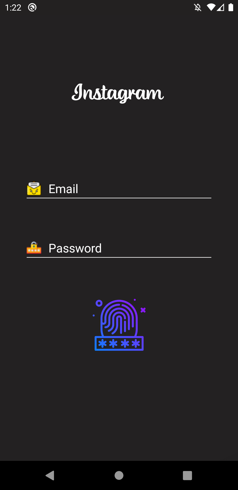
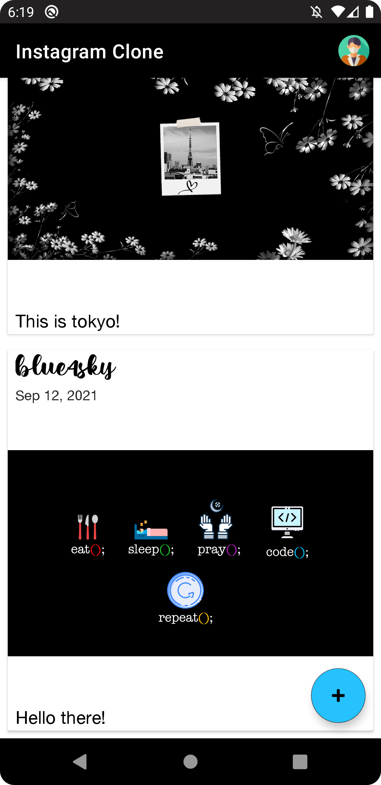
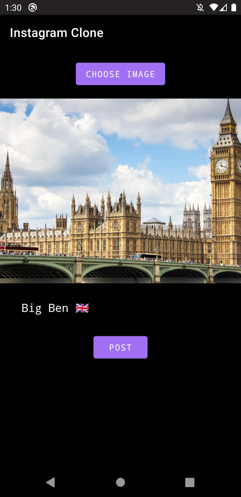

# Instagram Clone Android App

This app allows users to post a photo with a caption, just like the original Instagram App.
The posts from users or others will appear on the Home page.
Every user can also see their posts on the Profile page.
Each post will be stored in the Cloud Firestore.
Firebase Authentication is used to store the user's username and password.

## Technologies used
- Kotlin
- XML
- Android Studio
- Firebase

## Screenshots

#### This is the Login page. User can put their registered email address and password, then tap the Login button (depicts as a fingerprint).

#### This is the Home page. All posts (both image and caption) will be shown here. Users can log out from their account by tapping the profile icon at the top-right corner. Also, users can add a new post by tapping the FAB blue button.

#### When the user wants to make a new post, this page will be shown. The "Choose Image" button will let the user choose a photo from their phone and the user can also add a caption below the image. After that, the user just needs to tap the Post button and the post will be shown on the Home page.

## Download Link
[Give it a try! 📸](https://www.mediafire.com/file/761rt5b373n936v/Instagram_Clone.apk/file)
